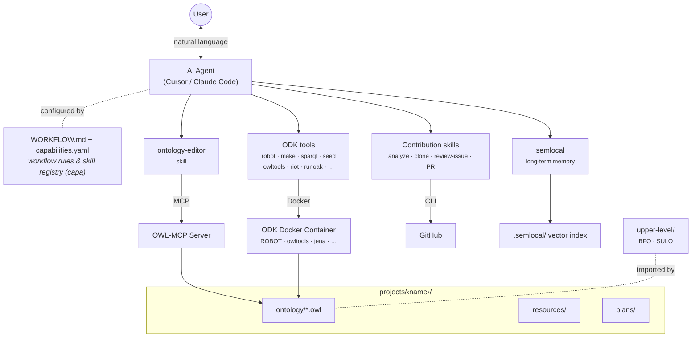

# Agentic Ontology Development Kit

Build or edit ontologies with AI assistance in Cursor or Claude Code. You install the required tools, put your ontology files in the right place, and tell the agent what you want. The agent handles scope, proposals, formalization, upper-ontology alignment (BFO or SULO), and checks.

## Architecture



## What you need to do

1. **Install prerequisites** (below).
2. **Run `capa install`** once in the project root after cloning.
3. **Put existing OWL files under `projects/<project_dir>/`** (e.g. `projects/my-ontology/ontology/my-ontology.owl`) if you are editing an existing ontology. For a new one, you can start from scratch or add an ODK config and ask the agent to seed the project.
4. **Chat with the agent**—describe your goal, answer when it asks which upper ontology to use (BFO or SULO), and approve proposals. It will edit the ontology, add imports, and run checks for you.

## Prerequisites

Install these before starting:


| Requirement             | Purpose                                                                                                                                          |
| ----------------------- | ------------------------------------------------------------------------------------------------------------------------------------------------ |
| **Docker**              | Used by the agent to run ROBOT, owltools, and other ontology tools. [Install Docker](https://docs.docker.com/get-docker/).                       |
| **Node.js** (v18+)      | Used to run project scripts. [Install Node.js](https://nodejs.org/).                                                                             |
| **semlocal**            | Local semantic memory. Install with `npm install -g semlocal`. Index stored in `.semlocal/`. [semlocal](https://github.com/Minitour/semlocal) |
| **capa**                | Syncs the agent’s skills and tools from this project. [CAPA](https://capa.infragate.ai/). After cloning, run `capa install` in the project root. |


## Setup

1. Clone the this repository and open it with your agent of choice
2. Run `capa install` and ensure your agent has access to the capa MCP server.
3. Add any relevant files you have to `projects/<project_dir>/resources`.

## Where to put your ontology files

- **Existing ontology**: Put your OWL file(s) under **`projects/<project_dir>/`**, for example `projects/my-ontology/ontology/my-ontology.owl`. The agent will work with whatever you put there.
- **New ontology (OBO/BFO style)**: You can add an ODK config YAML and ask the agent to seed the project, or create an empty OWL file in `projects/<project_dir>/ontology/` and describe what you want. The agent will ask whether to use BFO and will add imports and alignment.
- **New or existing ontology (SULO)**: Same as above—put OWL under `projects/<project_dir>/` (e.g. `projects/<project_dir>/ontology/`). When the agent asks which upper ontology to use, choose SULO; it will add SULO imports and alignment.

Upper ontologies (BFO and SULO) live in `upper-level/` for reference. You do not add them to your ontology yourself; the agent does that when you choose one.

## Project layout (reference)

```
ontology-builder/
├── capabilities.yaml   # Agent skills and tools (managed by capa)
├── WORKFLOW.md         # Agent instructions (for the agent, not you)
├── projects/           # One directory per ontology project
│   └── <project_dir>/  # e.g. my-ontology, envo
│       ├── ontology/   # e.g. projects/<project_dir>/ontology/my-ontology.owl
│       ├── plans/      # Draft proposals made by the agent
│       └── resources/  # Resources to give to the agent (PDFs, CSVs, etc.)
├── upper-level/        # BFO and SULO (reference only)
└── skills/             # Agent skills
```

